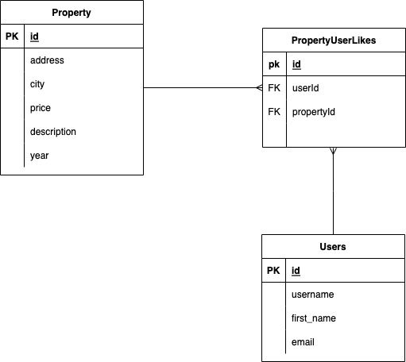

# HABI BACKEND CHALLENGE

This is an API used for retrieve some information about properties across different cities in LATAM.  

## Description
I decided to use a layers architecture 

## Technologies
- Python3
- Flask RESTful
- SQLAlchemy

## Installation

```bash
pip install requirements.txt
```

## Usage

### Linux/MacOS
```bash
EXPORT FLASK_APP = app.py
flask run
```

### Windows
```bash
SET FLASK_APP = app.py
flask run
```
## Faced problems

- One problem I found during the development was the filters sections because there was a lot of considerations we had to do because there was not an explicit specification about the price and the involved filters for that. So I decided to included filter for price between to quantities or an specific range

- Other one was how to separate the resource from the main app to have a decoupled code, so I decided to use blueprint to load the routers or resources from any part of the code.

## SECOND TASK

I decided to create a new table to have the register of the user and the property to have the register of all the likes, as we know a lot of user can have liked properties and a lot of properties can be liked, so we need a new table to handle the many to many relation.

```sql
CREATE TABLE PropertyUserLikes (
id INT(11) AUTO_INCREMENT PRIMARY KEY,
user_id INT (11) NOT NULL,
property_id INT (11) NOT NULL,
FOREIGN KEY (user_id) REFERENCES Users(Id),
FOREIGN KEY (property_id) REFERENCES Property(Id)
);

```
# Entity-Relation Diagram



